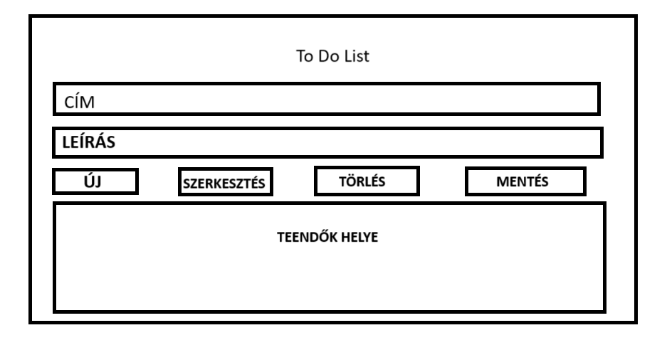
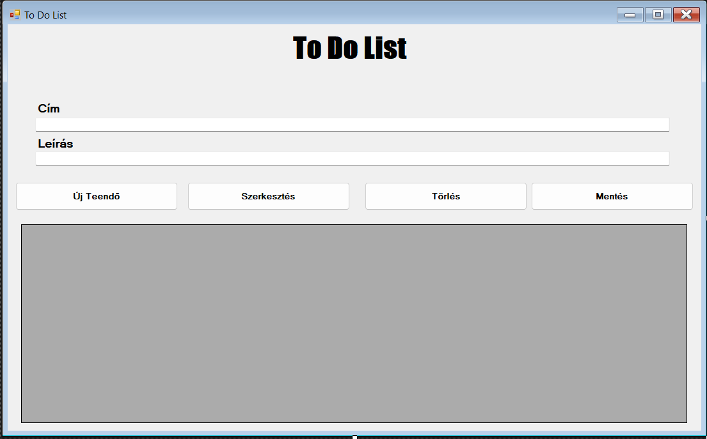

# Funkcionális Specifikáció
## 1. Jelenlegi helyzet

Jelenleg a Google nem rendelkezik To Do List-tel, így a felhasználók nem tudják követni mindennapi teendőiket. Ezért szeretnénk megkönnyíteni egy egyszerű szoftver segítségével, hogy a felhasználók rendszerezetten és egy helyen láthassák a fontos dolgaikat, teendőiket akár naptárban is.

## 2. Vágyálom rendszer

A projektünk célja, hogy egy könnyen használható és optimális To Do Listet hozzunk létre felhasználóink számára. A programnak egyszerűnek és könnyen átláthatónak kell lennie. Az alkalmazás funkciói: naptár, listák, emlékeztetők.

## 3. Jelenlegi üzleti folyamatok modellje

Jelenleg a felhasználók a régi Google Calendar-t használják, amiben a teendőiket gyakran nem látják át és rendszertelenül jelenik meg.

## 4. Igényelt üzleti folyamatok modellje

Egy olyan szoftver, amely alkalmas arra, hogy a korábban megszokott Google funkciókat együttesen lehessen alkalmazni az új alkalmazással, például a naptárt.

A To Do List nem sokban különbözik az alapmodelltől, tartalmazza:

- Naptár
- List (pl: bevásárlólista, napi rutin pontokba szedése)
- Reminder (pl: jelzik a felhasználónak, ha az általa megadott időpont nemsokára elérkezik)

## 5. Követelménylista

| ID | Név | Kifejtés |
| :---: | --- | --- |
| K1 | Cím | Tetszőleges cím ami jellemzi a teendőt|
| K2 | Leírás | Adott teendő elkészítése |
| K3 | Új | Létrehozhatnak egy új teendőt|
| K4 |Szerkesztés | Tudják szerkeszteni a kiválasztott teendőt|
| K5 | Törlés | Törölni tudják a teendőt|
| K6 | Mentés | Menteni tudják a teendőt|
| K7 | Tábla a felvett teendővel | Teendőinket itt látjuk amiket felvettünk |

## 6. Használati esetek

## 7. Megfeleltetés, hogyan fedik le a használati eseteket a követelményeket

## 8. Képernyőtervek

### Korai Látványterv

### Korai Prototípus

## 9. Forgatókönyvek

## 10. Funkció - követelmény megfeleltetése

## 11. Fogalomszótár

### Fogalomszótár

* To Do List: Teendőlista, olyan felület, ahol a felhasználók listázhatják és rendszerezhetik a teendőiket.
* Reminder: Emlékeztető, amely figyelmezteti a felhasználót egy előre meghatározott esemény időpontjára.
* Google Calendar: A Google naptárszolgáltatása, amely lehetőséget biztosít események és találkozók időzítésére.
* List: Lista, amely különböző teendőket vagy elemeket tartalmazhat, például bevásárlólistát vagy napi rutinokat.
* Prototípus: Az alkalmazás egy kezdeti, még fejlesztés alatt álló verziója, amely bemutatja az alapvető funkciókat.
