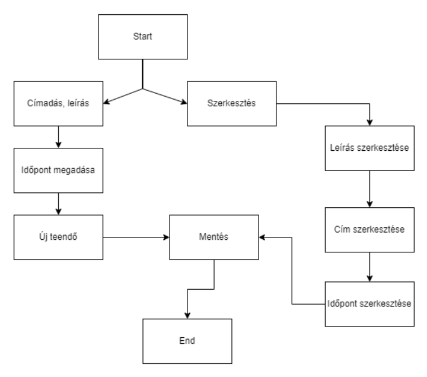

# Rendszerterv
## 1. A rendszer célja

A cégünk a Googletől kapott megbízást, hogy készítsünk egy To Do List-et, amivel a felhasználóinak a mindennapi beosztását és teendőit meg tudják könnyíteni. A célunk olyan szoftver készítése, ami átlátható, könnyen használható, gyors és rendszerezett. A szoftvert úgy terveztük, hogy maganélet és céges eseményeket is össze lehessen hangolni benne, gyorsan tanulható legyen mindenki számára. A rendszer alapköve az átlagos To Do List funkcióinak kibővítése és frissítése naptárral kiegészítve.

## 2. Projektterv

### 2.1 Projektszerepkörök, felelőségek

* Scrum master:
	-   Pántya Barnabás 	
* Product owner:
	-   Pántya Barnabás
* Üzleti szereplő:
	-   Megrendelő:
		 -  Bill Gates
   
### 2.2 Projektmunkások és felelőségek
   		
* Frontend:
	-   Hegyközi Petra
	-   Habóczki Szabolcs
* Backend:  
	-   Csonka Mihály
 	-   Vincze Ákos 
* Tesztelés:   
	-   Hegyközi Petra
	-   Vincze Ákos
	-   Habóczki Szabolcs
	-   Csonka Mihály

### 2.3 Ütemterv
|Funkció                  | Feladat                   | Prioritás | Becslés (nap) | Aktuális becslés (nap) | Eltelt idő (nap) | Határidő (nap) |
|-------------------------|---------------------------|-----------|---------------|------------------------|------------------|---------------------|
|Követelmény specifikáció |Megírás                    |         1 |             1 |                      1 |                1 |                   1 |             
|Funkcionális specifikáció|Megírás                    |         1 |             1 |                      1 |                1 |                   1 |
|Rendszerterv             |Megírás                    |         1 |             1 |                      1 |                1 |                   1 |
|Program                  |Vizuális tervek elkészítése|         2 |             1 |                      1 |                1 |                   1 |
|Program                  |Prototípus elkészítése     |         3 |             5 |                      5 |                0 |                   5 |
|Program                  |Alapfunkciók elkészítése   |         3 |             5 |                      5 |                0 |                   5 |
|Program                  |Extra funkciók elkészítése |         3 |             7 |                      7 |                0 |                   7 |
|Program                  |Tesztelés                  |         4 |             2 |                      2 |                0 |                   2 |

### 2.4 Mérföldkövek

* 09.24. Követelmény specifikáció elkészítése
* 09.27. Funkcionális specifikáció elkészítése
* 09.30. Rendszerterv elkészítése
* 10.07. Back- és Front-end elkészítése
* 10.08. Előzetes tesztelések és prototípus elkészítése
* 10.09. Prototípus prezentálása

## 3. Üzleti folyamatok modellje

### 3.1 Üzleti szereplők
A applikáció használatához nincs szükség regisztrációra. A telepítést követően a applikáció bármely felhasználó számára elérhető, teljesen egészében az összes funkcióval eggyütt.

### 3.2 Üzleti folyamatok
A program indulását követően a felhasználó azonnal használhatja a TO-DO-LIST minden funkcióját. A felhasználó választhat hogy teendőt akar létrehozni, szerkeszteni, törölni.

## 4. Követelmények

### Követelménytáblázat

| ID | Név | Kifejtés |
| :---: | --- | --- |
| K1 | Cím | Tetszőleges cím, ami jellemzi a teendőt|
| K2 | Leírás | Adott teendő elkészítése |
| K3 | Új | Létrehozhatnak egy új teendőt|
| K4 |Szerkesztés | Tudják szerkeszteni a kiválasztott teendőt|
| K5 | Törlés | Törölni tudják a teendőt|
| K6 | Mentés | Menteni tudják a teendőt|
| K7 | Tábla a felvett teendővel | Teendőinket itt látjuk amiket felvettünk |

### Funkcionális

* Új teendők felvétele, címmel és leírással
* A felhasználó által megadott teendők tárolása, módosításainak mentése
* Megakadályozni azt, hogy a felhasználó érvénytelen adatot adjon meg a naptárban

### Nem Funkcionális

* Átláthatónak és könnyen kezelhetőnek kell lennie
* A program nézzen ki viszonylag letisztultnak, modernnek

## 5. Funkcionális terv

### 5.1 Rendszerszereplők

A rendszer a felhasználó gépén fut helyileg, nem szükséges internetre kapcsolódni. A felhasználók között nem teszünk különbséget, mivel egyetlen jogosultsági kör van.

### 5.2 Menü-hierarchia:

* Interface:
	-   A program kezelésére használt gombok (bezárás, tálcára rakás)
	-   A felhasználó által megadható címet és leírást tartalmazó szövegdobozok
	-   Gombok, amelyek segítségével szerkeszteni, menteni vagy módosítani lehet egy teendőt
	-   Gomb egy új teendő hozzáadásához
	-   Lista, ahol szerepelnek a felhasználó által hozzáadott teendők

## 6. Fizikai környezet

### Vásárolt szoftverkomponensek, valamint esetleges külső rendszerek

Fejlesztés alatt nem használunk semmilyen vásárolt szoftvert.

### Hardver topológia

Standalone Workstation: Egyetlen számítógép, amelyen Windows fut. Nincs hálózati kapcsolat más gépekkel, az összes hardver (CPU, memória, tárhely, perifériák) közvetlenül a géphez van csatlakoztatva.

### Fizikai alrendszerek

Kliens gépek: A követelményeknek megfelelő, Windows-ra alkalmas PC-k, amin telepítve van a .Net keretrendszer.

### Fejlesztő eszközök

IDE:Visual Studio 2024

## 7. Architekturális terv

A program használatához nincs szükség sem internetkapcsolatra, sem külső adatbázisra.
Az alkalmazás a felhasználó számítógépén futtatható, ha a szükséges .NET keretrendszer telepítve van. 

## 8. Adatbázis terv

Az alkalmazásunkhoz nem szükséges adatbázis. Az adatokat egy .txt kiterjesztésű fájlban tároljuk a felhasználó számítógépén, ezt a program felhasználásával lehet írni és olvasni.

## 9. Implementációs terv

* A felhasználói felület: Windows Forms alkalmazás
* .NET keretrendszert használ a program, ezzel lehetővé téve az alkalmazás indítását és futtatását

## 10. Tesztterv

A rendszerterv szerint implementált szoftver tesztelésének célja az Üzleti folyamatok modellje című pontban meghatározott folyamatok helyes, gördülékeny lefutása.

A tesztelés során használt kliens hardverek a napjainkban általánosan elterjedt hardverkonfigurációjú PC-k illetve laptopok. A minimum hardverkonfiguráció: Intel Celeron processzor, 8GB RAM, 128GB SDD, a képernyők felbontása 1280x1024 vagy 1920x1080.

A tesztelés során a szoftver megfelelő működését vizsgáljuk. Amennyiben az elvártnak megfelelő eredményt kapunk, a teszt eset sikeresnek tekinthető, ellenkező esetben a hibát rögzítjük a teszt jegyzőkönyvben.

## 11. Telepítési terv

Fizikai telepítési terv: A To do list nem csatlakozik adatbázishoz (csak egy txt fájlba vannak az adatok), webszerverhez és internethez, csak a számítógépen kell futtatni.

Szoftver telepítési terv: Szükségünk van egy minimum 64-bites Windows-t futtató számítógépre, hogy futtathassuk a programot.

## 12. Karbantartási terv

Az alkalmazás nem igényel különösebb karbantartást, újabb funkciók hozzáadása esetén a felhasználó számára frissítést teszünk elérhetővé.
